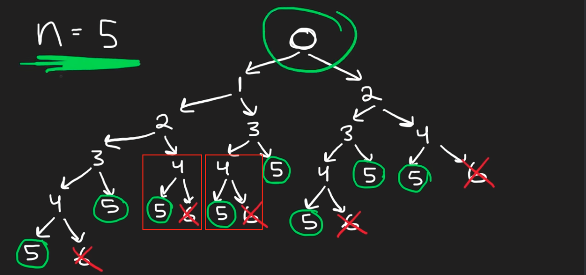
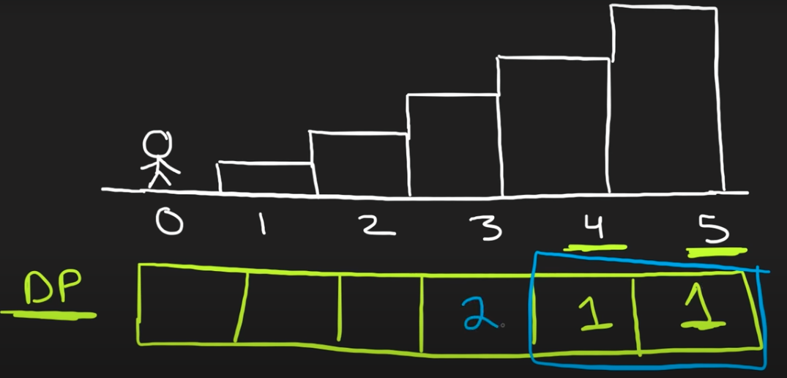

# Dynamic Programming

## Introduction

- Dynamic Programming is mainly an optimization over plain recursion. Wherever we see a recursive solution that has repeated calls for same inputs, we can optimize it using Dynamic Programming. The idea is to simply store the results of subproblems, so that we do not have to re-compute them when needed later. This simple optimization reduces time complexities from exponential to polynomial.

### Difference between DP and Divide-and-Conquer

- Divide and Conquer: to solve these problems is inefficient as the **same common sub-sub-problems have to be solved many times**
- DP: solve each of them **once** and their answers are **stored** in a table for future reference

### Tips

- **Tips**: For Dynamic Programming, it s very important to write down the `recurrence relationship` like below

  - `d(i,j)` cell = relationship with its neighbors: `d(i, j+1)`, `d(i+1, j)`, `d(i+1, j+1)`
    

- **Key Points**: DP can be done either by `Recursive (Top-Down)` or `Iterative (Bottom-Up)` Approach
- **Key Points**: Cache `memo` can be passed into the function as an input param

### Example of DP

- Example 1: Climbing Stairs
  - You are climbing a staircase. It takes `n` steps to reach the top.
  - Each time you can either climb `1` or `2` steps. In how many distinct ways can you climb to the top?

```Python
Input: n = 3
Output: 3
Explanation: There are three ways to climb to the top.
1. 1 step + 1 step + 1 step
2. 1 step + 2 steps
3. 2 steps + 1 step
```

- We can observe there is a repeated sub-problem, say at the `node = 4` there is only either 5 (accepted) or 6 (rejected) as the result

<p align="center"></p>

- **Solution 1 (Top-Down)**:
  - At the `node=5`, we only have 1 way (step=1) to reach the top
  - At the `node=4`, we also only have 1 way (step=1) to reach the top
  - At the `node=3`, we also only have 2 ways (step=1, step 2) to reach the top

<p align="center"></p>

```Python
one, two = 1, 1
for i in range(n-1):
    temp = one
    one = one + two
    two = temp
return one
```

- **Solution 2 (Bottom-Up)**:
  - If `n=1`, there are 1 way to reach
  - If `n=2`, there are 2 ways to reach
  - If `n=3`, it can be reached from n=1 (1 way) or n=2 (2 ways), so totally can 1+2=3 ways to reach

```Python
class Solution(object):
    def climbStairs(self, n, memoize={1:1, 2:2}):
        """
        :type n: int
        :rtype: int
        """
        if n not in memoize:
            memoize[n] = self.climbStairs(n-1, memoize) + self.climbStairs(n-2, memoize)
        return memoize[n]
```
