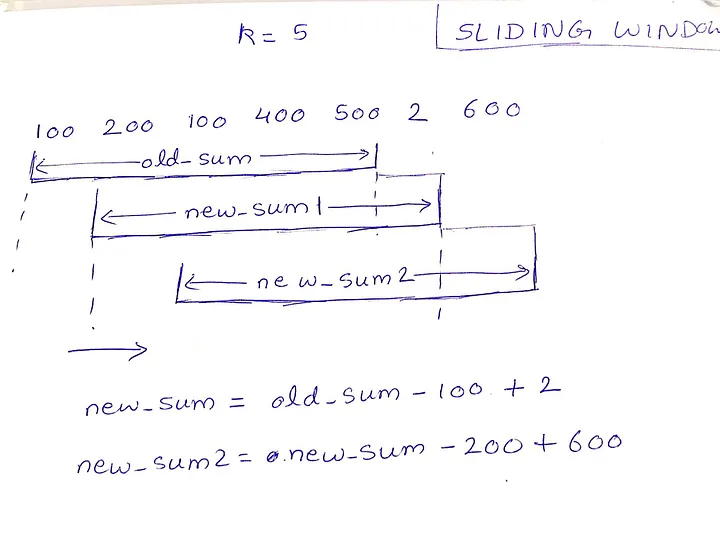

# Sliding Windows

## Introduction

- Template for the Sliding Windows problem:

```Python
class Solution(object):
    def lengthOfLongestSubstring(self, s):
        """
        :type s: str
        :rtype: int
        """

        # initialise left and right pointer
        l, r = 0, 1
        sub_set, max_len = set(s[l]), 1

        # ensure that r pointer is not exceed then len(s)
        while r < len(s):
            if s[r] not in sub_set:
                sub_set.add(s[r])
                max_len = max(max_len, len(sub_set))
                r += 1
            else:
                # if r in the sub_set, we will remove the left-most item out of the sub_set
                # increase l pointer to the next pos
                sub_set.remove(s[l])
                l += 1

        return max_len

```

## Examples

```C
nums = [100, 200, 100, 400, 500, 2, 600]
k = 3


// BRUTE FORCE O(N^2): iterate through all windows of size k
s1 = 100 + 200 + 100
s2 = 200 + 100 + 400
s3 = 100 + 400 + 500

for(int i = 0; i < n-k+1; i++){
    int current_sum = 0;

    for(int j = 0; j < k; j++){
        current_sum = current_sum + arr[i+j];
    }
    max_sum = max(current_sum, max_sum);    // pick maximum sum
}
```

<p align="center"></p>

```C
// SLIDING WINDOWS O(N):
int max_sum = 0, window_sum = 0;
/* calculate sum of 1st window */
for (int i = 0; i < k; i++)  window_sum += arr[i];
/* slide window from start to end in array. */

for (int i = k; i < n; i++){
    window_sum += arr[i] - arr[i-k];    // saving re-computation
    max_sum = max(max_sum, window_sum);
}
```

## Resources

- [Medium - Sliding Windows for Strings](https://medium.com/leetcode-patterns/leetcode-pattern-2-sliding-windows-for-strings-e19af105316b)
- [Leetcode - Sliding Window algorithm template to solve all the Leetcode substring search problem.](https://leetcode.com/problems/find-all-anagrams-in-a-string/solutions/92007/sliding-window-algorithm-template-to-solve-all-the-leetcode-substring-search-problem/)
- [Leetcode - C++ Maximum Sliding Window Cheatsheet Template](https://leetcode.com/problems/frequency-of-the-most-frequent-element/solutions/1175088/C++-Maximum-Sliding-Window-Cheatsheet-Template/)
